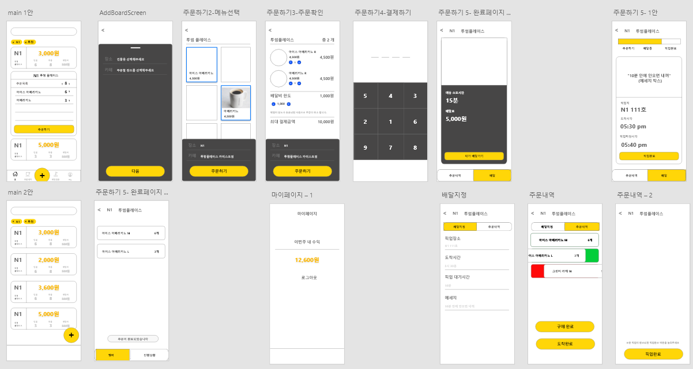

# Dev.Coffee
???: 커피 뭐드실래요?
개발자들에게 커피란 혈액과도 같은 소중한 존재.
환자에게 수혈하듯 꾸준한 공급이 필요하다.

다만 한창 아이디어가 떠올라 개발에 열중인데 커피를 사러 가기는 타이밍이 좋지 않고,
그렇다고 누군가에게 그냥 시키기엔 미안하다면,
받는 사람도 부담스럽지 않은 자연스러운 보상이 있다면 어떨까?

Dev.Coffee는 바로 이런 아이디어에서 출발한 공동 커피 구매 플랫폼이다.

# FrontEnd# Front End

## Overview

React-Native를 통해서 프론트를 개발했으며 Axios를 통해 서버와 http 통신을 했다.

### Flow

전체적인 flow는 아래와 같다. main 화면에 로그인을 하면 같이 주문을 할 방들이 존재한다. 그리고 방을 클릭하면 메뉴를 주문할 수 있게 된다.

pin 번호를 입력하여 결제를 진행하며 같은 방 안에 있는 사람들 중에서 한 명이 돈을 받고 배달을 나가면 된다.



아래는 axios를 통해 서버와 통신하는 부분이다. board를 create하는 request를 보내고, board id를 response로 받아온다.

```jsx
const createBoard = async () => {
        try {
        const response = await axios.post(
            'http://192.249.18.141:80/api/board/create',{   
                shop: cafe, destination: place
        }).then(function(response){
            setBoardId(response.data._id)
            navigate();
        }); 
        } catch (e) {
            console.log(e)
        }
    };
```


